# 使用RSA加密JWT令牌

## 认证服务器——非对称加密JWT令牌

非对称加密算法需要两个密钥：公开密钥（publickey:简称公钥）和私有密钥（privatekey:简称私钥）。公钥与私钥是一对，如果用私钥对数据进行加密，只有用对应的公钥才能解密。

### 生成秘钥证书
公私密钥可以用jdk的命令keytool生成：别名为 oauth2，秘钥算法为 RSA，秘钥口令为 oauth2，秘钥库（文件）名称为 oauth2.jks，秘钥库（文件）口令为 oauth2
```shell
keytool -genkeypair -alias oauth2 -keyalg RSA -keypass oauth2 -keystore oauth2.jks -storepass oauth2
```
内容随便填写
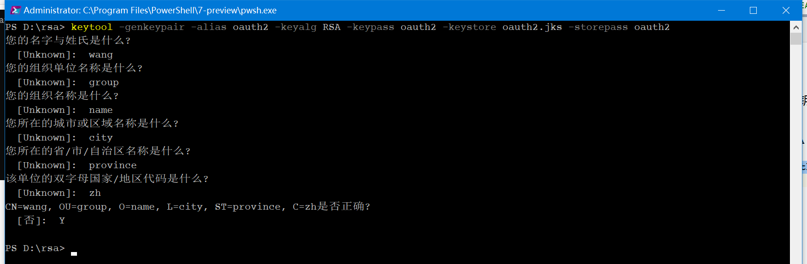

生成后，在命令执行命令的所在目录下会有一个oauth2.jks文件
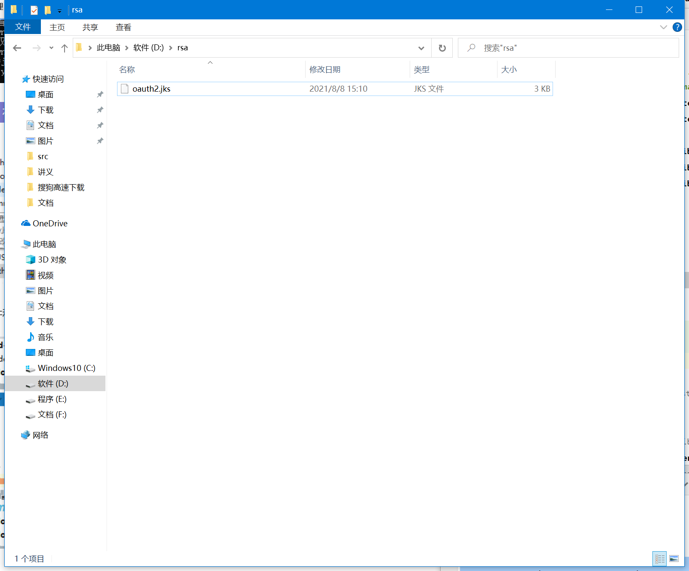
将该文件移动到认证服务的resources目录下：
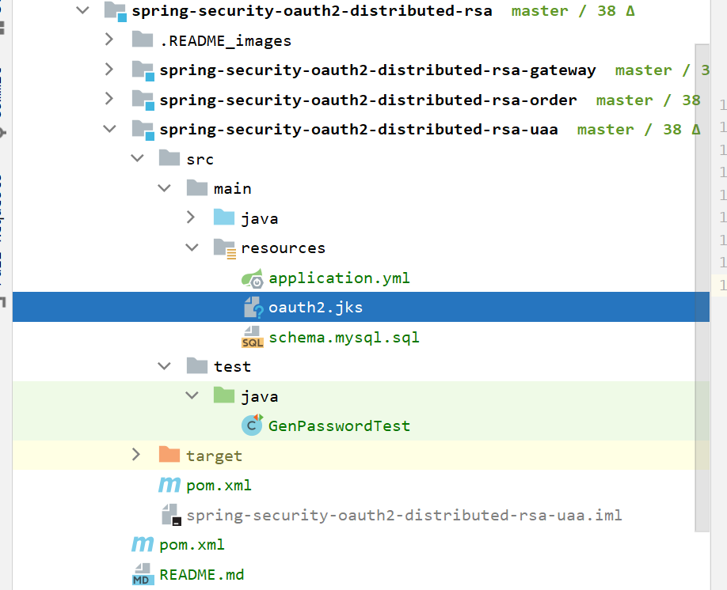

### 非对称加密JWT令牌
修改认证服务spring-security-oauth2-distributed-rsa-uaa的TokenConfig类：
```java
@Configuration
public class TokenConfig {

    private final static String KEYSTORE = "oauth2.jks";
    private final static String ALIAS = "oauth2";
    private final static String PASSWORD = "oauth2";


    @Bean
    public TokenStore tokenStore() {
        //JWT令牌存储方案
        return new JwtTokenStore(accessTokenConverter());
    }

    @Bean
    public JwtAccessTokenConverter accessTokenConverter() {
        JwtAccessTokenConverter jwtAccessTokenConverter = new JwtAccessTokenConverter();
        KeyStoreKeyFactory keyFactory = new KeyStoreKeyFactory(new ClassPathResource(KEYSTORE),
                PASSWORD.toCharArray());
        jwtAccessTokenConverter.setKeyPair(keyFactory.getKeyPair(ALIAS));
        return jwtAccessTokenConverter;
    }
}
```
### 修改pom文件
修改认证服务spring-security-oauth2-distributed-rsa-uaa的pom文件，添加
```xml
    <build>
        <resources>
            <resource>
                <!-- 防止JKS被maven错误解析 -->
                <directory>src/main/resources</directory>
                <filtering>false</filtering>
            </resource>
        </resources>
    </build>
```
## 资源服务器——非对称加密JWT令牌
### 证据密钥文件获取公钥
OpenSSL 是一个加解密工具包，可以使用 OpenSSL 来获取公钥，下载网址。下载地址：
http://slproweb.com/products/Win32OpenSSL.html
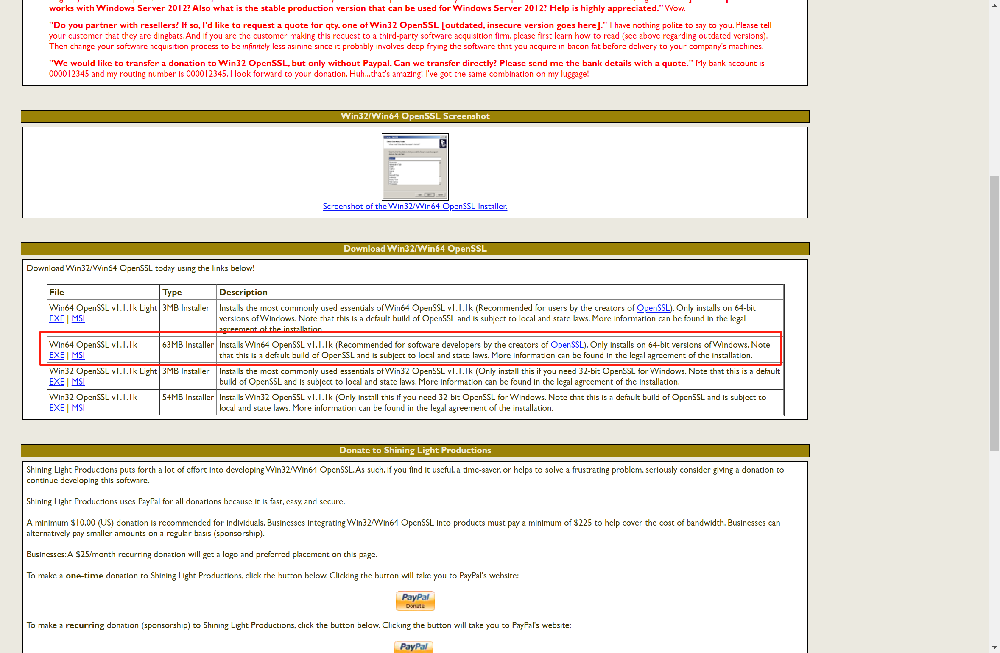

### 配置OpenSSL环境变量
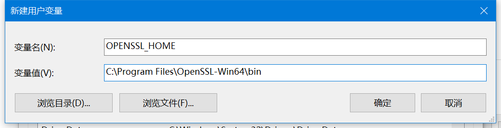
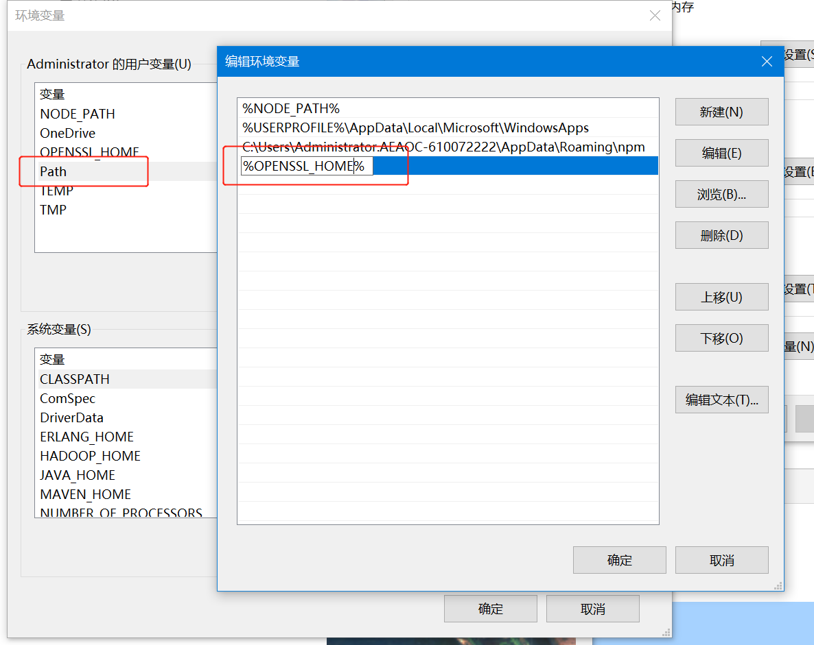
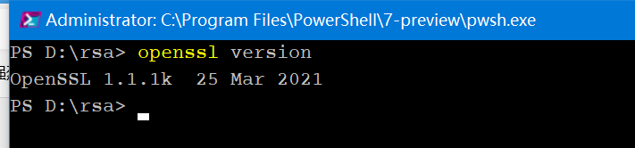

### 获取公钥
进入oauth2.jks所在目录执行命令
```shell
keytool -list -rfc --keystore oauth2.jks | openssl x509 -inform pem -pubkey
```
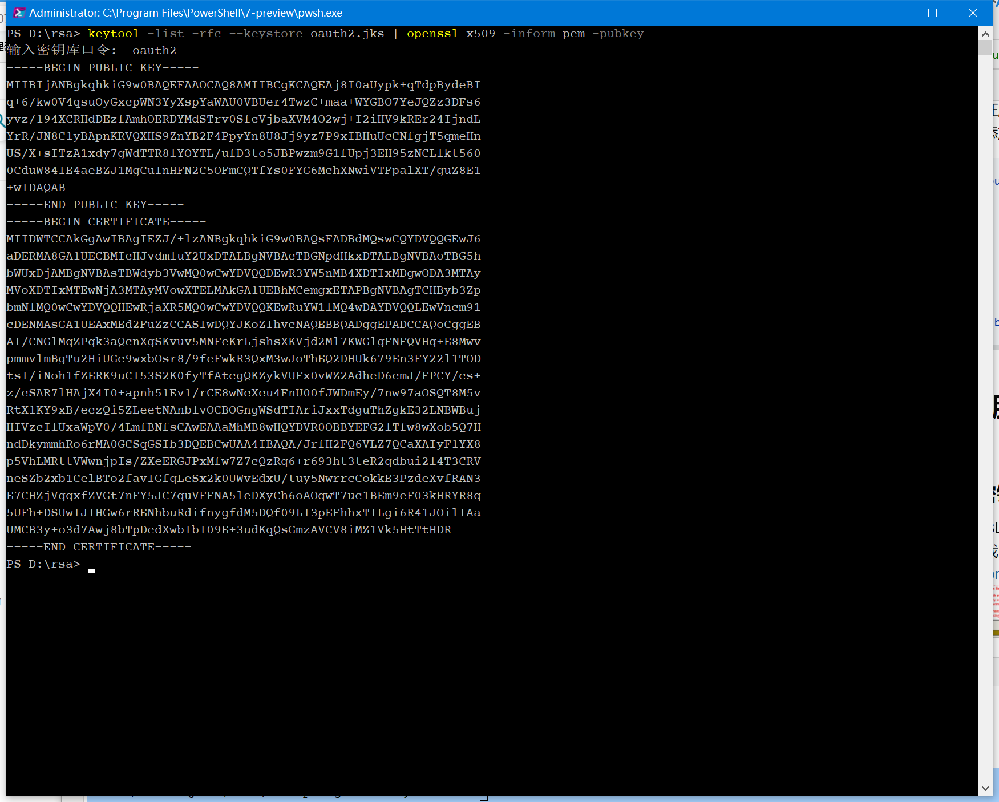
复制出控制台打印出的内容到public.txt，并放到资源服务器的resources目录下(需要复制出public key的内容)
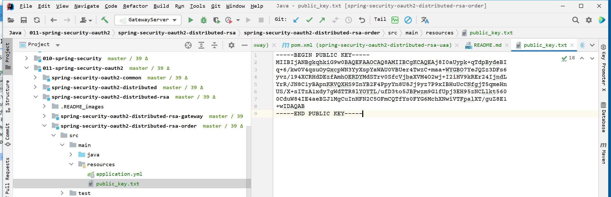

### 非对称加密JWT令牌
修改资源服务器的TokenConfig类：
```java
@Slf4j
@Configuration
public class TokenConfig {
    private final static String PUBLIC_KEY_FILE = "public_key.txt";

    @Bean
    public TokenStore tokenStore() {
        //JWT令牌存储方案
        return new JwtTokenStore(accessTokenConverter());
    }

    @Bean
    public JwtAccessTokenConverter accessTokenConverter() {
        JwtAccessTokenConverter jwtAccessTokenConverter = new JwtAccessTokenConverter();
        ClassPathResource classPathResource = new ClassPathResource(PUBLIC_KEY_FILE);

        String publicKey;
        try {
            publicKey= IOUtils.toString(classPathResource.getInputStream(),"UTF-8");
            log.info("public key: {}" , publicKey);
        } catch (IOException e) {
            log.error("load public key error.", e);
            throw new RuntimeException(e);
        }
        jwtAccessTokenConverter.setVerifierKey(publicKey);
        return jwtAccessTokenConverter;
    }
}
```

## 测试
启动三服务

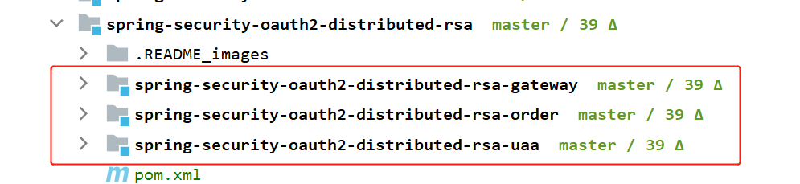

先请求access_token令牌
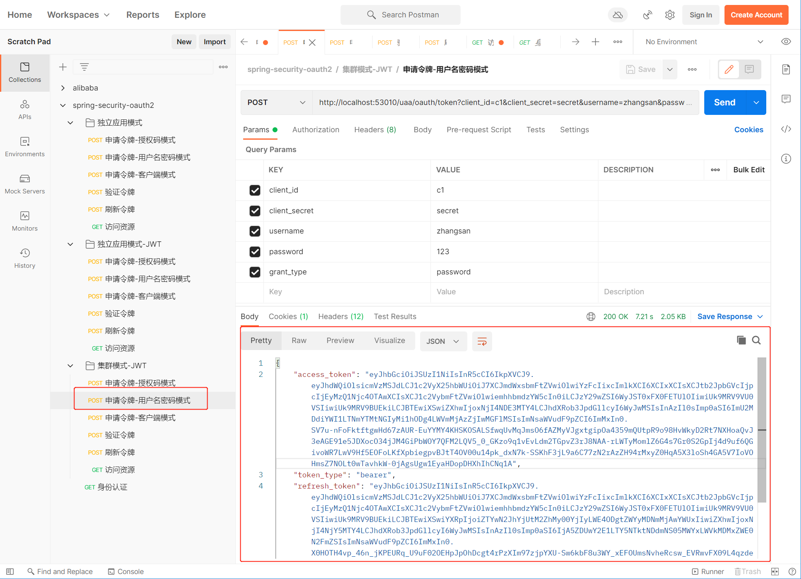
分别测试有权限和无权限的服务
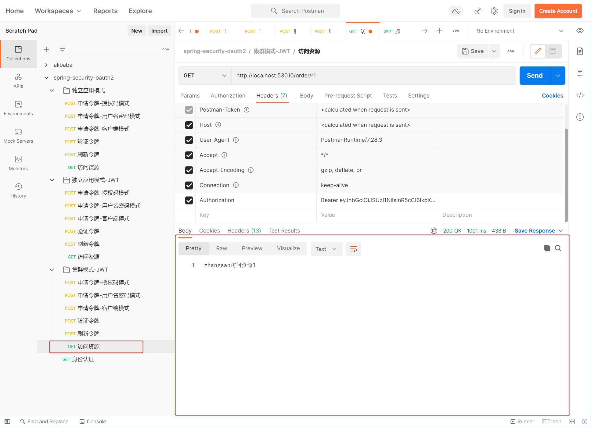
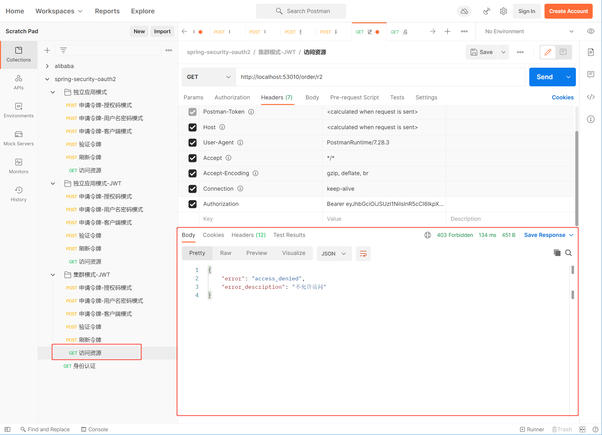


